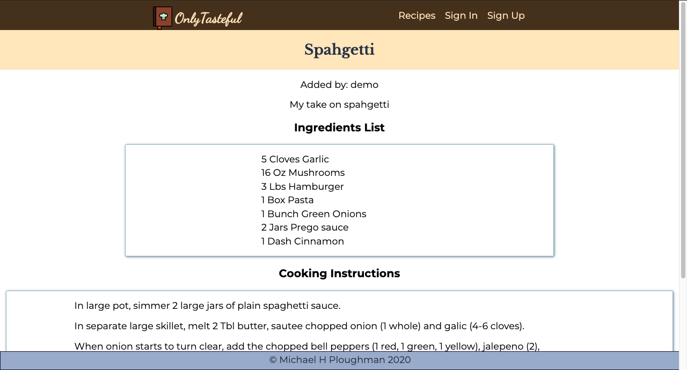

# OnlyTasteful

Find it live at:[https://only-tasteful.now.sh/]](https://only-tasteful.now.sh/)
A cook book for the modern cook. 

## Summary

This project is a solution to keeping one's recipes in a basic note taking
app. This is a purpose built app for collecting recipes, modifying them, noting changes you've tried, ect.

## Screenshots

## API Built With

* [Node](https://nodejs.org/) - Backend framework
* [Postgresql](https://www.postgresql.org/) - Database implementation
* [Knex](http://knexjs.org/) - SQL query builder
* JSON Web Tokens
* [Heroku](https://www.heroku.com/) - API deployed to Heroku and requisitioning a Postgresql DB, using the Heroku CLI tool.

## Authors

* **Michael H Ploughman** - *Initial work* - [Evoxus](https://github.com/Evoxus)

## Acknowledgments

* Thinkful